# ABE 516X Final Project- Anaerobic Digestion Efficiency

## Project Introduction
Hi, welcome to my (Luke Soko) final project for ABE 516X. 

In 2021, the United States emitted 6.34 billion tonnes of CO2e, which is approximately the weight of 11 billion cows... in gas.
Simultaneously, natural gas consumption continues to rise.

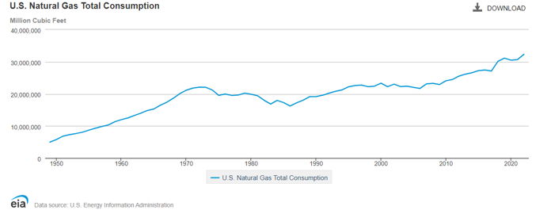

Right now, we need natural gas. It's highly likely your home or apartment has furnaces, water heaters, and ovens powered by natural gas. Nearby factories likely have natural-gas-powered boilers which generate steam to operate heat exchangers and stripping columns. The United States currently has a strong dependency on natural gas and operates using roughly 3,000,000 miles of natural gas pipelines, which is enough pipeline to wrap around the entire planet 120 times.

Anaerobic digestion can help mitigate both issues. Anaerobic digestion uses microorganisms to break down organic matter (in an environment without oxygen) to produce biogas, which is roughly 60% methane (CH4). CH4 is the primary component of natural gas. For this reason, I use CH4 and natural gas interchangably. Biogas from an anerobic digester can enter an upgrader (membrane filter or other technology) which can purify the biogas to >95% CH4, which can be injected into natural gas pipelines as renewable natural gas. Equally as important, the renewable natural gas is also biogenic natural gas. Biogenic natural gas implies that the carbon in the natural gas was initially derived from the atmosphere, instead of being pulled from carbon storage thousands of feet below the Earth's surface (fossil natural gas). Biogenic natural gas inherently has less overall global warming potenital than fossil natural gas.

Across the US, there are ~2,000,000 farms, but only ~330 operating manure-based anaerobic digesters. Why? They're historically unprofitable. 

Nonetheless, recently, thanks to Low Carbon Fuel Standard (LCFS) and Renewable Idenfitication Number (RIN) carbon credits, anaerobic digestion can be profitable in specific scenarios. My research models anaerobic digestion profitability. My goal is to publish profitable scenarios for anaerobic digester use to stimulate anaerobic digester implementation and reduce agricultural greenhouse gas emissions.

## Research Questions
There are many different types of anaerobic digesters. One important step for my research is to identify which type of digester is best for which scenario. Over 95% of operating anaerobic digesters are either plug flow, complete mix, or covered lagoon digester types. Therefore, these three digester types are analyzed. 

Plug flow anaerobic digester without its top cover and without feedstock. Feedstock is typically heated, not mixed, and serpentines through vessel over many days.


Cross-section of a complete mix digester vessel. Feedstock is heated and mixed in vessel over many days.

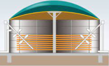

Operating covered lagoon digester. Feedstock is not heated or mixed and typically stays in lagoon for many weeks or months.

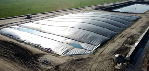

The capital cost varies among these three digester types, though their biogas production varies as well. 
My first question is- what is the digestion efficiency of each type of digester? 
My second question is- given a number of livestock and digester type, what is the daily biogas production?


I calculate the efficiency at which each digester type generates biogas using the EPA Agstar Digester Database
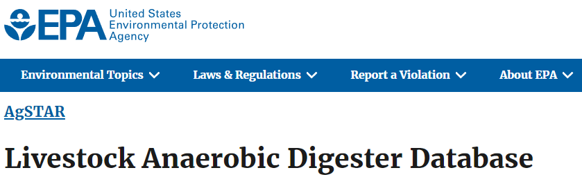

I predict biogas production using Naive Bayes and Random Forest machine learning.

I also relate covered lagoon digester biogas production to location... and show there's little correlation.

## Quick Note: Digester "Efficiency"
A digestion process with maximum, or 100% digestion efficiency, can be approximately related to the biochemical methane potential (BMP) of a particular substrate. The BMP of dairy and swine manure is published in downloadable calculators from the California Air Resouces Board. 


Manure production can be found in ASAE D384.2 MAR2005 Manure Production and Characteristics. Using these two resources, and assuming a 60% CH4 content in biogas, I calculated a maximum daily biogas production of 101.3 ft3/day for a dairy cow and 8.9 ft3/day for a swine. To calculated digester efficiency values, the daily biogas production per animal values will be compared to the aforementioned maximum daily biogas productions.


## EPA AgSTAR Database and Data Wrangling

After uploading the AgSTAR Anaerobic Digestion Database to python, the database should look similar to picture below.

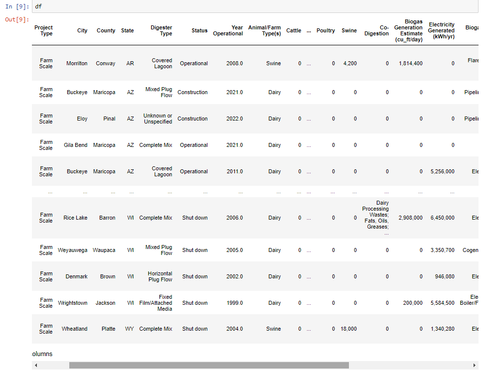

To work with the data in Python, I had to remove commas within the data and reassign some string values as integer values.
```js
df[' Biogas Generation Estimate (cu_ft/day) ']=df[' Biogas Generation Estimate (cu_ft/day) '].str.replace(',','')
df[' Electricity Generated (kWh/yr) ']=df[' Electricity Generated (kWh/yr) '].str.replace(',','')
df['Dairy']=df['Dairy'].str.replace(',','')
df['Swine']=df['Swine'].str.replace(',','')
df.fillna(0,inplace=True)
df = df.astype({' Biogas Generation Estimate (cu_ft/day) ':'int'})
df = df.astype({' Electricity Generated (kWh/yr) ': 'int'})
df = df.astype({'Dairy':'int'})
df = df.astype({'Swine':'int'})
```

> This is a blockquote following a header.
>
> When something is important enough, you do it even if the odds are not in your favor.

### Header 3

Text can be **bold**, _italic_, or ~~strikethrough~~.

[Link to another page](./another-page.html).


```js
def efficiency(data_dairy):
    eff_calc = (data_dairy/101.336)*100
    return  eff_calc
```
1

```js
#95% confidence interval filter for data - 2 standard deviations

def hist_filter_ci(data):
    Y_upper = np.percentile(data['Biogas_ft3/cow'], 97.5)
    Y_lower = np.percentile(data['Biogas_ft3/cow'], 2.5)
    filtered_hist_data = data[(data['Biogas_ft3/cow'] >= Y_lower) & (data['Biogas_ft3/cow'] <= Y_upper)]
    return filtered_hist_data
```

```js
#68% confidence interval filter for data- 1 standard deviation

def hist_filter_ci_68(data):
    Y_upper = np.percentile(data['Biogas_ft3/cow'], 84)
    Y_lower = np.percentile(data['Biogas_ft3/cow'], 16)
    filtered_hist_data = data[(data['Biogas_ft3/cow'] >= Y_lower) & (data['Biogas_ft3/cow'] <= Y_upper)]
    return filtered_hist_data
```
Dairy- all digester types

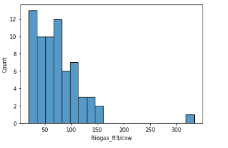

Dairy- Plug flow

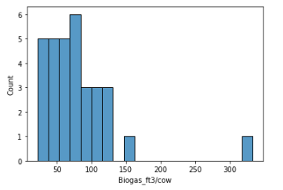

Dairy- Complete mix

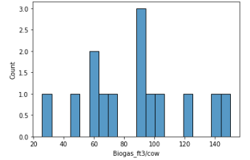

Dairy- Impermeable cover

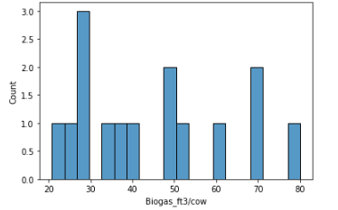

Dairy- Plug flow and complete mix (heated anaerobic digesters)

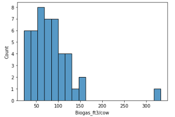


| Digester Type      | Efficiency (95% CI)|Efficiency (68% CI) |
|:-------------------|:-------------------|:-------------------|
| All digester types | 68.8%              | 65.8%              |
| Plug flow          | 73.7%              | 71.3%              |
| Complete mix       | 85.9%              | 82.7%              |
| Impermeable Cover  | 43.1%              | 41.1%              |


```js
dairy_biogas2 = smf.ols(formula='Biogas_gen_ft3_day ~ Dairy', data=dairy_biogas).fit()
sns.regplot('Dairy', 'Biogas_gen_ft3_day', data=dairy_biogas, ci =95)
```

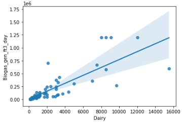

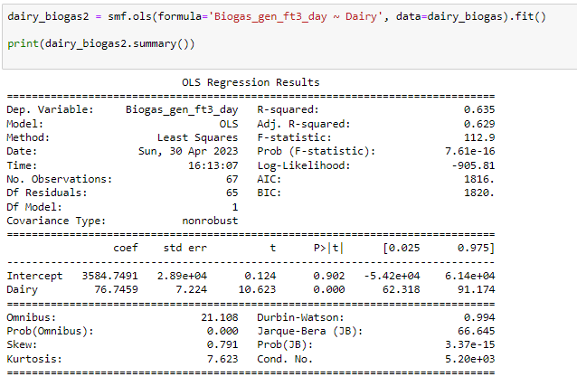

```js
sns.regplot('Dairy', 'Biogas_gen_ft3_day', data=dairy_biogas, ci = 95)

Y_upper_dairy_biogas = dairy_biogas['Dairy']*91.174+.000614
Y_lower_dairy_biogas = dairy_biogas['Dairy']*62.318-.000542

plt.scatter(dairy_biogas['Dairy'], dairy_biogas['Biogas_gen_ft3_day'])
plt.scatter(dairy_biogas['Dairy'], Y_upper_dairy_biogas, color = 'red')
plt.scatter(dairy_biogas['Dairy'], Y_lower_dairy_biogas, color = 'red')

plt.show
```
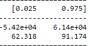


```js
def filter_confidence_interval(data):
    Y_upper = data['Dairy']*91.174+.000614
    Y_lower = data['Dairy']*62.318-.000542
    filtered_data = data[(data['Biogas_gen_ft3_day'] >= Y_lower) & (data['Biogas_gen_ft3_day'] <= Y_upper)]
    return filtered_data
```

```js
df3.drop(df3[(df3['Animal'] != 'Dairy')].index, inplace = True)
df3.drop(df3[(df3['Codigestion'] != 0)].index, inplace = True)
df3.drop(df3[(df3['Biogas_gen_ft3_day'] == 0)].index, inplace = True)
df3['Biogas_ft3/cow'] = df3['Biogas_gen_ft3_day'] / df3['Dairy']

#df3.drop(df3[(df3['Biogas_End_Use'] == 0)].index, inplace = True)

#selecting for 'Vertical Plug Flow', 'Horizontal Plug Flow', and 'Plug Flow - Unspecified', 'Modular Plug Flow', 'Mixed Plug FLow'

notwant = ['Covered Lagoon', 'Unknown or Unspecified',
       'Complete Mix', 0,
       'Fixed Film/Attached Media',
       'Primary digester tank with secondary covered lagoon',
       'Induced Blanket Reactor', 'Anaerobic Sequencing Batch Reactor', 'Complete Mix Mini Digester', 'Dry Digester', 
       'Microdigester']

df3 = df3[~df3['Digester Type'].isin(notwant)]
```

```ruby
# Ruby code with syntax highlighting
GitHubPages::Dependencies.gems.each do |gem, version|
  s.add_dependency(gem, "= #{version}")
end
```

```js
df.bayes["Digester Type"].replace('Covered Lagoon',1, inplace = True)
df.bayes["Digester Type"].replace('Mixed Plug Flow',2, inplace =True)
df.bayes["Digester Type"].replace('Horizontal Plug Flow',2, inplace = True)
df.bayes["Digester Type"].replace('Vertical Plug Flow',2, inplace = True)
df.bayes["Digester Type"].replace('Plug Flow - Unspecified',2,inplace = True)
df.bayes["Digester Type"].replace('Complete Mix',3,inplace = True)
```

```js
df.bayes['biogas/dairy'] = df.bayes['Biogas_gen_ft3_day']/df.bayes['Dairy']

def pred_filter(data):
    Y_upper = np.percentile(data['biogas/dairy'], 97.5)
    Y_lower = np.percentile(data['biogas/dairy'], 2.5)
    filtered_hist_data = data[(data['biogas/dairy'] >= Y_lower) & (data['biogas/dairy'] <= Y_upper)]
    return filtered_hist_data
    
df_bayes_clean = pred_filter(df.bayes).drop(columns=['biogas/dairy'])
```

```js
X1 = df_bayes_clean.drop(["Biogas_gen_ft3_day"], axis = 1)
Y1 = df_bayes_clean["Biogas_gen_ft3_day"]

x_train1, x_test1, y_train1, y_test1 = train_test_split(X1, Y1, random_state = 1)

x_train1 = np.array(x_train1)
y_train1 = np.array(y_train1).squeeze()

nb.fit(x_train1, y_train1)

y_predicted = nb.predict(x_test1)
accuracy_score(y_test1, y_predicted)

def biogas_pred_nb(digester_type,dairy):
    biogas = nb.predict([[digester_type,dairy]])
    dairy_eff = nb.predict([[digester_type,dairy]])/dairy/101.336
    return biogas, dairy_eff
    
biogas_pred_nb(1,5000)
biogas_pred_nb(2,5000)
biogas_pred_nb(3,5000)
```


```js
df_forest_clean = df_bayes_clean
X = df_forest_clean.drop(["Biogas_gen_ft3_day"], axis = 1)
y = df_forest_clean["Biogas_gen_ft3_day"]

from sklearn.model_selection import train_test_split
import sklearn.ensemble as ske

X_train, X_test, Y_train, Y_test = train_test_split(X, y, test_size = 0.25, random_state = 0)

reg = ske.RandomForestRegressor(n_estimators = 1000, random_state = 0)
Y_train = np.ravel(Y_train)
reg.fit(X_train, Y_train)
Y_pred = reg.predict(X_test)

def biogas_pred_rf(digester_type,dairy):
    biogas = reg.predict([[digester_type,dairy]])
    dairy_eff = reg.predict([[digester_type,dairy]])/dairy/101.336
    return biogas, dairy_eff

biogas_pred_rf(1,5000)
biogas_pred_rf(2,5000)
biogas_pred_rf(3,5000)
```


#### Header 4

*   This is an unordered list following a header.
*   This is an unordered list following a header.
*   This is an unordered list following a header.

##### Header 5

1.  This is an ordered list following a header.
2.  This is an ordered list following a header.
3.  This is an ordered list following a header.

###### Header 6

| head1        | head two          | three |
|:-------------|:------------------|:------|
| ok           | good swedish fish | nice  |
| out of stock | good and plenty   | nice  |
| ok           | good `oreos`      | hmm   |
| ok           | good `zoute` drop | yumm  |

### There's a horizontal rule below this.

* * *

### Here is an unordered list:

*   Item foo
*   Item bar
*   Item baz
*   Item zip

### And an ordered list:

1.  Item one
1.  Item two
1.  Item three
1.  Item four

### And a nested list:

- level 1 item
  - level 2 item
  - level 2 item
    - level 3 item
    - level 3 item
- level 1 item
  - level 2 item
  - level 2 item
  - level 2 item
- level 1 item
  - level 2 item
  - level 2 item
- level 1 item

### Small image


### Large image


### Definition lists can be used with HTML syntax.

<dl>
<dt>Name</dt>
<dd>Godzilla</dd>
<dt>Born</dt>
<dd>1952</dd>
<dt>Birthplace</dt>
<dd>Japan</dd>
<dt>Color</dt>
<dd>Green</dd>
</dl>

```
Long, single-line code blocks should not wrap. They should horizontally scroll if they are too long. This line should be long enough to demonstrate this.
```
1
```
The final element.
```
