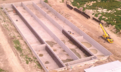

# ABE 516X Final Project- Anaerobic Digestion Efficiency


## Project Introduction
Hi, welcome to my (Luke Soko) final project for ABE 516X. 

In 2021, the United States emitted 6.34 billion tonnes of CO2e, which is approximately the weight of 11 billion cows... in gas.
Simultaneously, natural gas consumption continues to rise.


Currently, we need natural gas. It's highly likely your home or apartment has furnaces, water heaters, and ovens powered by natural gas. Nearby factories likely have natural-gas-powered boilers which generate steam to operate heat exchangers and stripping columns. The United States has a strong dependency on natural gas and operates using roughly 3,000,000 miles of natural gas pipelines, which is enough pipeline to wrap around the entire planet 120 times.

Anaerobic digestion can help mitigate both issues. Anaerobic digestion uses microorganisms to break down organic matter (in an environment without oxygen) to produce biogas, which is roughly 60% methane (CH4). CH4 is the primary component of natural gas. For this reason, I use CH4 and natural gas interchangably. Biogas from an anerobic digester can enter an upgrader (membrane filter or other technology) which can purify the biogas to >95% CH4, which can be injected into natural gas pipelines as renewable natural gas. Equally as important, the renewable natural gas is also biogenic natural gas. Biogenic natural gas implies that the carbon in the natural gas was initially derived from the atmosphere, instead of being pulled from carbon storage thousands of feet below the Earth's surface (fossil natural gas). Biogenic natural gas inherently has less overall global warming potenital than fossil natural gas.

Across the US, there are ~2,000,000 farms but only ~330 operating manure-based anaerobic digesters. Why? They're historically unprofitable. 

Nonetheless, recently, thanks to Low Carbon Fuel Standard (LCFS) and Renewable Idenfitication Number (RIN) carbon credits, anaerobic digestion can be profitable in specific scenarios. My research models anaerobic digestion profitability. My goal is to publish profitable scenarios for anaerobic digester use to stimulate anaerobic digester implementation to reduce overall greenhouse gas emissions.

## Research Questions
There are many different types of anaerobic digesters. One important step for my research is to identify which type of digester is best for which scenario. Over 95% of operating anaerobic digesters are either plug flow, complete mix, or covered lagoon digester types. Therefore, these three digester types are analyzed. 

Below is a plug flow anaerobic digester without its top cover and without feedstock. The feedstock is typically heated, not mixed, and serpentines through the vessel for some time generally between 7 and 30 days.



Below is a cross-section of a complete mix digester vessel. The feedstock is heated and mixed in the vessel for some time generally between 3 and 30 days.


Below is an operating covered lagoon (impermeable cover) digester. The feedstock is not heated or mixed and typically stays in the lagoon for many weeks or months.


The capital cost varies among these three digester types, though their biogas production varies as well. 

My first question: what is the digestion efficiency of each type of digester? 

My second question: given a number of livestock and digester type, what is the daily biogas production?


I calculate the efficiency at which each digester type generates biogas using the EPA AgSTAR Digester Database.
I predict biogas production using Naive Bayes and Random Forest machine learning.


## Quick Note: Digester "Efficiency"
A digestion process with maximum, or 100% digestion efficiency, can be approximately related to the biochemical methane potential (BMP) of a particular substrate. The BMP of dairy and swine manure is published in downloadable calculators (Compliance Offset Protocol Livestock Projects) from the California Air Resouces Board. Manure production can be found in ASAE D384.2 MAR2005 Manure Production and Characteristics. Using these two resources, and assuming a 60% CH4 content in biogas, I calculated a maximum daily biogas production of 101.3 ft3/day for a dairy cow and 8.9 ft3/day for a swine. To calculate digester efficiency values, the daily biogas production per animal values will be compared to the aforementioned maximum daily biogas productions.


## EPA AgSTAR Database and Data Wrangling

After uploading the AgSTAR Anaerobic Digestion Database to Python, the database should look similar to the picture below.


To work with the data in Python, I had to remove commas within the data and reassign some string values as integer values.
```js
df[' Biogas Generation Estimate (cu_ft/day) ']=df[' Biogas Generation Estimate (cu_ft/day) '].str.replace(',','')
df[' Electricity Generated (kWh/yr) ']=df[' Electricity Generated (kWh/yr) '].str.replace(',','')
df['Dairy']=df['Dairy'].str.replace(',','')
df['Swine']=df['Swine'].str.replace(',','')
df.fillna(0,inplace=True)
df = df.astype({' Biogas Generation Estimate (cu_ft/day) ':'int'})
df = df.astype({' Electricity Generated (kWh/yr) ': 'int'})
df = df.astype({'Dairy':'int'})
df = df.astype({'Swine':'int'})
```

Next, I drop undesired rows of data. The data of interest depends on the specific analysis. Below, I show code where I drop data if the animal is not a dairy cow, if there is codigestion involved, if the daily biogas produciton is not reported, and if the digester is not a plug flow digester type. 

For every analysis, I drop data if there is codigestion involved (mutliple feedstocks entering the digester). Typically, codigestion means there is an agricultural residue (corn stover, wheat stalks, brewers grains, etc) added along with manure to the digester. My maximum biogas per animal values, which are used to calculate digester efficiency, are based on a manure-only operating digester.

I also added a new column called "Biogas_ft3/cow", which is the daily biogas production per cow.

```js
df3.drop(df3[(df3['Animal'] != 'Dairy')].index, inplace = True)
df3.drop(df3[(df3['Codigestion'] != 0)].index, inplace = True)
df3.drop(df3[(df3['Biogas_gen_ft3_day'] == 0)].index, inplace = True)
df3['Biogas_ft3/cow'] = df3['Biogas_gen_ft3_day'] / df3['Dairy']

#df3.drop(df3[(df3['Biogas_End_Use'] == 0)].index, inplace = True)

#selecting for 'Vertical Plug Flow', 'Horizontal Plug Flow', and 'Plug Flow - Unspecified', 'Modular Plug Flow', 'Mixed Plug FLow'

notwant = ['Covered Lagoon', 'Unknown or Unspecified',
       'Complete Mix', 0,
       'Fixed Film/Attached Media',
       'Primary digester tank with secondary covered lagoon',
       'Induced Blanket Reactor', 'Anaerobic Sequencing Batch Reactor', 'Complete Mix Mini Digester', 'Dry Digester', 
       'Microdigester']

df3 = df3[~df3['Digester Type'].isin(notwant)]
```
## Efficiency Analysis
Histograms featuring daily biogas production per cow, or "Biogas ft3/cow", for different digester types, are shown below.

Dairy- all digester types


Dairy- Plug flow


Dairy- Complete mix


Dairy- Impermeable cover


Dairy- Plug flow and complete mix (heated anaerobic digesters)


The daily biogas generation is a number that is reported to the EPA by the farm; it is not a calculated number. Digester owners could misreport their daily biogas production, thereby skewing the distribution of this dataset. The histograms of the daily biogas per animal distributions are almost all right skewed (a few over-optimistic owners) and contain clear outliers. 

I built functions to filter out outliers to help solve for a more accurate mean daily biogas production per cow. The "95% confidence interval filter for data - 2 standard deviations", removes any data above the 97.5 percentile of the distribution and below the 2.5 percentile of the distribution. Therefore, that function removes all data outside of two standard deviations of the mean. The "68% confidence interval filer for data - 1 standard deviation" removes any data above the 84th percentile of the distribution and below the 16th percentile of the distribution. Therefore, that function removes all data outside of one standard deviations of the mean. 

```js
#95% confidence interval filter for data - 2 standard deviations

def hist_filter_ci(data):
    Y_upper = np.percentile(data['Biogas_ft3/cow'], 97.5)
    Y_lower = np.percentile(data['Biogas_ft3/cow'], 2.5)
    filtered_hist_data = data[(data['Biogas_ft3/cow'] >= Y_lower) & (data['Biogas_ft3/cow'] <= Y_upper)]
    return filtered_hist_data
```

```js
#68% confidence interval filter for data- 1 standard deviation

def hist_filter_ci_68(data):
    Y_upper = np.percentile(data['Biogas_ft3/cow'], 84)
    Y_lower = np.percentile(data['Biogas_ft3/cow'], 16)
    filtered_hist_data = data[(data['Biogas_ft3/cow'] >= Y_lower) & (data['Biogas_ft3/cow'] <= Y_upper)]
    return filtered_hist_data
```
After filtering the "Biogas_ft3/cow" data, thereby removing outliers for each digester type, I calculate the mean "Biogas_ft3/cow". The mean "Biogas_ft3/cow" is then inputted into the function, "efficiency", to calculate the digester efficiency. An example is shown below, followed by a summary of dairy anaerobic digester efficiencies.

```js
def efficiency(data_dairy):
    eff_calc = (data_dairy/101.336)*100
    return  eff_calc
    
efficiency(ci95_df5['Biogas_ft3/cow'].mean())
```
Table 1: Dairy anaerobic digester efficiencies
| Digester Type      | Efficiency (95% CI)|Efficiency (68% CI) |
|:-------------------|:-------------------|:-------------------|
| All digester types | 68.8%              | 65.8%              |
| Plug flow          | 73.7%              | 71.3%              |
| Complete mix       | 85.9%              | 82.7%              |
| Impermeable Cover  | 43.1%              | 41.1%              |


## Regression Analysis
I built linear regression models, where the independent variable is the number of dairy cows and the dependent variable is the daily biogas production, for different types of digesters of dairy manure. I also built 95% confidence intervals and added lines representing the upper and lower limits of the confidence interval into the regression models.

```js
sns.regplot('Dairy', 'Biogas_gen_ft3_day', data=dairy_biogas, ci =95)
```

Dairy- All digester types


Dairy- Plug flow


Dairy- Complete mix


Dairy- Impermeable cover (Covered lagoon)


I solve for the regression coefficients using statsmodels.formula.api (imported as smf) ordinary least squares (OLS) method. 

Dairy- All digester types


The OLS report features regression coefficients for 2.5 and 97.5 data percentiles, which allows me to code lines for upper and lower limits of a 95% confidence interval as shown below.
```js
sns.regplot('Dairy', 'Biogas_gen_ft3_day', data=dairy_biogas, ci = 95)

Y_upper_dairy_biogas = dairy_biogas['Dairy']*91.174+.000614
Y_lower_dairy_biogas = dairy_biogas['Dairy']*62.318-.000542

plt.scatter(dairy_biogas['Dairy'], dairy_biogas['Biogas_gen_ft3_day'])
plt.scatter(dairy_biogas['Dairy'], Y_upper_dairy_biogas, color = 'red')
plt.scatter(dairy_biogas['Dairy'], Y_lower_dairy_biogas, color = 'red')

plt.show
```

Dairy- all digester types


Dairy- Plug flow


Dairy- Complete mix


Dairy- Impermeable cover


## Covered Lagoon Digester Location Analysis

Covered lagoon digesters (impermeable cover digesters) are not heated. Biogas production is heavily influenced by temperature. Typically, plug flow and complete mix digesters are heated to mesophilic temperature (37 degrees Celsius or 98.6 degrees Fahrenheit). One would imagine that covered lagoon digesters in southern states, featuring hotter average temperatures, would produce more biogas, or more energy overall per animal, than covered lagoon digesters in northern states. To test this hypothesis, I created the three graphs below. Based on the visual of the graphs, and the overall lack of data, it does not seem as though we can conclude that southern states are associated with significantly greater energy production per animal compared to northern states. 


## Machine Learning Analysis

### Naive Bayes

Naive Bayes machine learning is completed to predict the daily biogas production from an inputted number of dairy cows and an inputted digester type. Naive Bayes is a poor way to predict daily biogas production based on this data. Naive Bayes machine learns based on categories, not on a continuous regression spectrum. For any input, Naive Bayes will output a biogas production value that corresponds to a value in the training dataset. 

Data wrangling

```js
df.bayes = df9[["Digester Type","Dairy","Biogas_gen_ft3_day"]].copy()

#I want 'Covered Lagoon', 'Mixed Plug Flow','Complete Mix','Horizontal Plug Flow','Vertical Plug Flow','Plug Flow - Unspecified'

notwant = ['Unknown or Unspecified', 0,'Fixed Film/Attached Media','Primary digester tank with secondary covered lagoon','Induced Blanket Reactor', 'Anaerobic Sequencing Batch Reactor', 'Complete Mix Mini Digester','Dry Digester', 'Modular Plug Flow','Microdigester']

df.bayes = df.bayes[~df.bayes['Digester Type'].isin(notwant)]
df.bayes.drop(df.bayes[(df.bayes['Biogas_gen_ft3_day'] == 0)].index, inplace = True)
df.bayes.drop(df.bayes[(df.bayes['Dairy'] == 0)].index, inplace = True)
```

To simplify the machine learning, I number coded the anaerobic digester types where 1 = covered lagoon, 2 = plug flow, and 3 = complete mix. 

```js
df.bayes["Digester Type"].replace('Covered Lagoon',1, inplace = True)
df.bayes["Digester Type"].replace('Mixed Plug Flow',2, inplace =True)
df.bayes["Digester Type"].replace('Horizontal Plug Flow',2, inplace = True)
df.bayes["Digester Type"].replace('Vertical Plug Flow',2, inplace = True)
df.bayes["Digester Type"].replace('Plug Flow - Unspecified',2,inplace = True)
df.bayes["Digester Type"].replace('Complete Mix',3,inplace = True)
```

Filtering out outliers. Any row containing daily biogas production per cow data that is outside of two standard deviations is deleleted from the data frame.

```js
df.bayes['biogas/dairy'] = df.bayes['Biogas_gen_ft3_day']/df.bayes['Dairy']

def pred_filter(data):
    Y_upper = np.percentile(data['biogas/dairy'], 97.5)
    Y_lower = np.percentile(data['biogas/dairy'], 2.5)
    filtered_hist_data = data[(data['biogas/dairy'] >= Y_lower) & (data['biogas/dairy'] <= Y_upper)]
    return filtered_hist_data
    
df_bayes_clean = pred_filter(df.bayes).drop(columns=['biogas/dairy'])
```

Naive Bayes machine learning code.

```js
X1 = df_bayes_clean.drop(["Biogas_gen_ft3_day"], axis = 1)
Y1 = df_bayes_clean["Biogas_gen_ft3_day"]

x_train1, x_test1, y_train1, y_test1 = train_test_split(X1, Y1, random_state = 1)

x_train1 = np.array(x_train1)
y_train1 = np.array(y_train1).squeeze()

nb.fit(x_train1, y_train1)

y_predicted = nb.predict(x_test1)
accuracy_score(y_test1, y_predicted)
```

Function to predict daily biogas production, given an inputted digester type and inputted number of dairy cows.
```js
def biogas_pred_nb(digester_type,dairy):
    biogas = nb.predict([[digester_type,dairy]])
    dairy_eff = nb.predict([[digester_type,dairy]])/dairy/101.336
    return biogas, dairy_eff
    
biogas_pred_nb(1,5000)
biogas_pred_nb(2,5000)
biogas_pred_nb(3,5000)
```

### Random Forest
Random forest machine learning is completed in this section to predict the daily biogas production from an inputted number of dairy cows and an inputted digester type. Random Forest machine learning can effectively model a continuous regression model.

```js
df_forest_clean = df_bayes_clean
X = df_forest_clean.drop(["Biogas_gen_ft3_day"], axis = 1)
y = df_forest_clean["Biogas_gen_ft3_day"]

from sklearn.model_selection import train_test_split
import sklearn.ensemble as ske

X_train, X_test, Y_train, Y_test = train_test_split(X, y, test_size = 0.25, random_state = 0)

reg = ske.RandomForestRegressor(n_estimators = 1000, random_state = 0)
Y_train = np.ravel(Y_train)
reg.fit(X_train, Y_train)
Y_pred = reg.predict(X_test)
```

Function to predict daily biogas production, given an inputted digester type and inputted number of dairy.
```js
def biogas_pred_rf(digester_type,dairy):
    biogas = reg.predict([[digester_type,dairy]])
    dairy_eff = reg.predict([[digester_type,dairy]])/dairy/101.336
    return biogas, dairy_eff

biogas_pred_rf(1,5000)
biogas_pred_rf(2,5000)
biogas_pred_rf(3,5000)
```


Table 2: Daily biogas predictions (ft3 biogas/day) and digester efficiency percentages for an anaerobic digester operation digesting manure from 5000 dairy cows
| Digester Type      | Naive Bayes Biogas |Random Forest Biogas|Naive Bayes Digester Efficiency|Random Forest Digester Efficiency|
|:-------------------|:-------------------|:-------------------|:------------------------------|---------------------------------|
| Plug flow          | 1,200,000          | 352,651            | 236.8%                        | 69.6%                           |
| Complete mix       | 432,000            | 325,077            | 85.3%                         | 64.2%                           |
| Impermeable Cover  | 1,200,000          | 270,735            | 236.8%                        | 53.4%                           |

The random forest efficiency prediction are significantly closer to the efficiency values calculated using the histograms and one and two standard deviation filters.

## ABE 516X Discussion 
This website incorporates basic data wrangling (deleting rows and adding rows from a dataframe based on parameters), functions (filters for values outside of standard deviations and efficiency function), histograms, linear regression, OLS report and plotted confidence intervals, Naive Bayes machines learning, and Random Forest machine learning. All methods were learned while taking the ABE 516X course at Iowa State University. The most important part of this analysis was calculating digester efficiencies and figuring out that Random Forest is a significantly better machine learning mechanism for continuous regression application compared to Naive Bayes. The Random Forest model does not predict biogas production values as accurately as I'd hoped, although with more data, potentially from European countries, the Random Forest model will grow stronger and more accurate (more accurate defined by a lesser root mean squared error). Currently, the Naive Bayes and Random Forest models operate using 2 columnds and 107 rows of inputted data. Larger amounts of data generally increase the accuracy of machine learning models.

The daily biogas per animal histogram data is filtered using functions that omit data outside one or two standard deviations from the mean. Standard deviation and percentile-based filtering mechanisms are most effectively applied to true normally distributed data. I showed that most of data featured right skew distributions, or not true normal distributions. Therefore, I knowingly applied a filtering technique to omit high daily biogas per animal data. I assumed that high daily biogas per animal values were a result of misreporting, misinterpretation, or incorrect sensor outputs. Nonetheless, I could be wrong. Some high daily biogas per animal values could be accurate, and omitting parts of the data could reduce the accuracy of this analysis. I also assume the BMP values reported by the California Air Resources Board are correct. Any change in a BMP value would result in a change in the 100% efficiency of digestion benchmark, which would alter all digester type efficiency values.

This data analysis is completely reproducible and accessable to all of the general public who have access to an internet browser, Excel, and Python. The digester database can be found via a Google search "EPA AgSTAR anaerobic digester database". Then, the database can be uploaded to Python. Next, a user could follow along with this website, sample code from the website, and regenerate the graphs and table values shown in this website. NOTE: Before uploading the digester database Excel spreadsheet to Python, I deleted 3 cells of data containing the value "-" within the column "Electricity Generated (kWh/yr)". Data wrangling for this very particular flaw in the dataframe seemed significantly more tedious in Python, so I completed this step in Excel.

## Conclusion
America continues to generate a massive amount of CO2e and has been incapable of curbing its dependence on natural gas. Anaerobic digestion can reduce agricultural greenhouse gas emissions and generate renewable, biogenic, natural gas. To increase implementation of anaerobic digestion, profitable scenarios for anaerobic digestion should be modeled. To accurately model anaerobic digestion systems, and to choose the best type of anaerobic digester for a particular scenario, the digestion efficiency of each type of anaerobic digester should be well understoood.

This website calculates digestion efficiency for different types of dairy manure-based anaerobic digesters using daily biogas per dairy cow values derived from the EPA AgSTAR Anaerobic Digester Database. Efficiency calculations are made by comparing daily biogas per cow values to the BMP and manure production values found in the  California Air Resource Board "Compliance Offset Protocol Livestock Projects" calculator and ASAE standard 384.2, respectively. Digestion efficiencies are summarized in Table 1, where complete mix digesters are between 83% to 86% efficient, plug flow digesters are between 66% to 69% efficient, and covered lagoon (impermeable cover) digesters are between 41% to 43% efficient, when digesting dairy manure, alone.  

This website also features linear regressions and confidence intervals for complete mix, plug flow, and covered lagoon digesters where the independent variable is the number of dairy cows and the dependent variable is the daily biogas production. Also, this website demonstrates that there is likely insufficient data to conclude that covered lagoon digesters demonstrate greater energy production per animal in southern states when compared to northern states.

Lastly, machine learning was used to predict daily biogas production given an input of digester type and an input of number of dairy cows. Naive Bayes is a poor machine learning method for continuous regression models featuring relatively small amounts of data (214 datapoints). Naive Bayes predicted a digester efficiency value of 237% for plug flow and covered lagoon digesters. Random Forest is a more effective machine learning method for continuous regression models, as featured by digester efficiency values of 70%, 64%, and 53% for 5000 head dairy plug flow, complete mix, and covered lagoon digester operations, respectively. The accuracy or root mean squared error associated with the Random Forest model is still undesirable. More data would likely strengthen the Random Forest model and provide better predictions. Besides getting more data on biogas production from manure-based anaerobic digesters, my next steps are to solve for the costs assocatiated with building and operating anaerobic digesters. By having a better understanding of the costs and revenues associated with each type of anaerobic digester, I can better predict which type of anaerobic digester is most profitable for a specific scenario.


